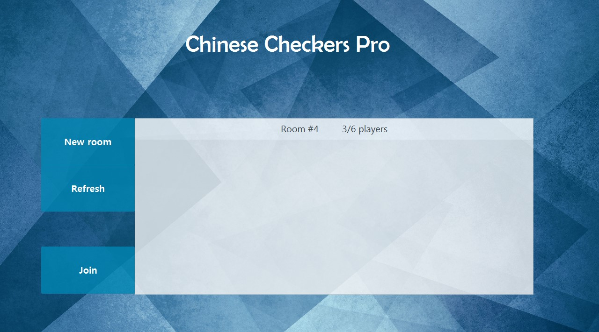
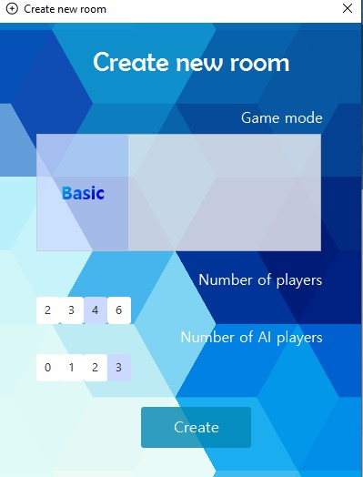

# ChineseCheckersServer
<h6>Backend server for Chinese Checkers game. Client can be fount here: https://github.com/malinowska423/ChineseCheckers.</h6>

Server is working on java sockets and is doing all the logic for the game. It takes an information about the move of current player and 
then send update to all connected players. 

Using the <b><a href=https://github.com/malinowska423/ChineseCheckers>client</a></b> you can: 
<ul>
<li> Create room for up to 6 players </li>
<li> Look through already created lobbies and join them if there is a space for you </li>
<li> Play with basic Ai </li>
<li> Play with friends through local or simulated ethernet network (eg. logMeIn Hamachi)
</ul>

<ul>
</img>
</img>
</ul>

